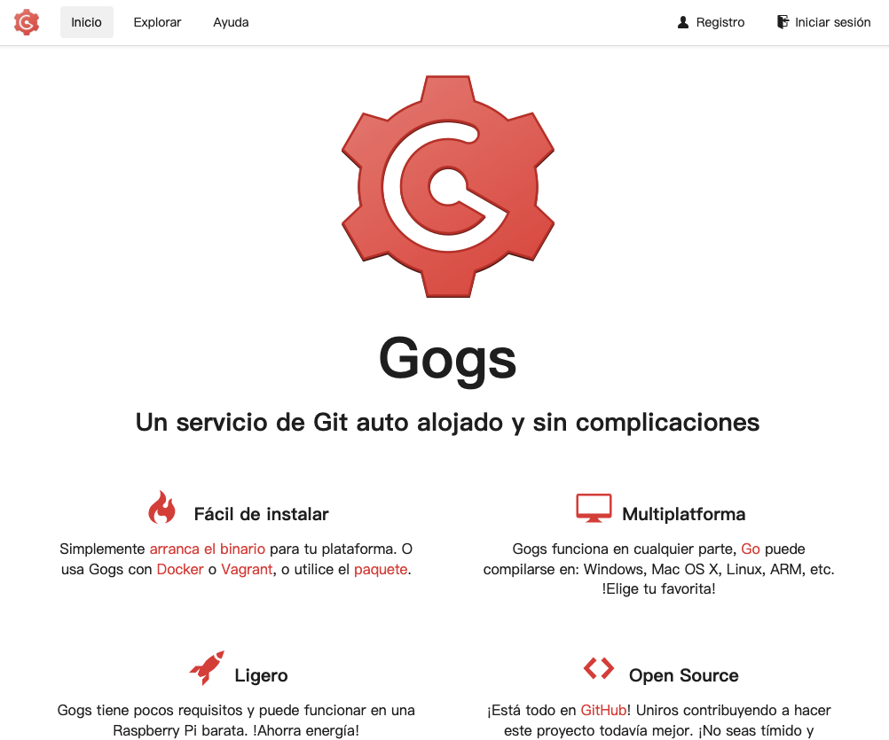
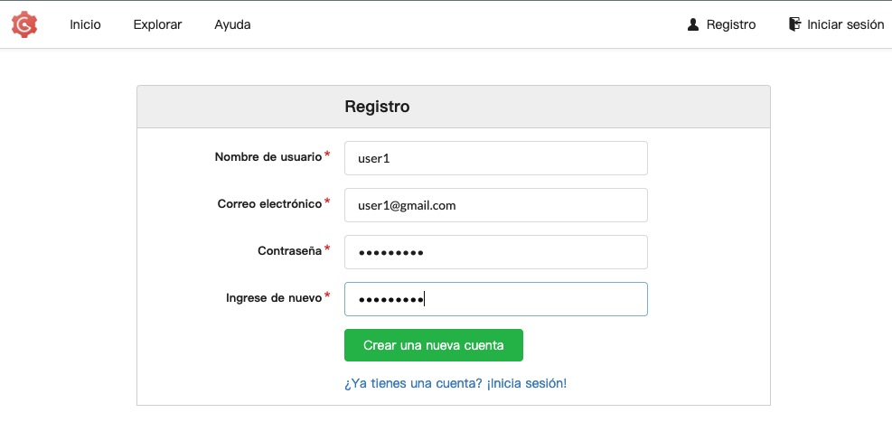
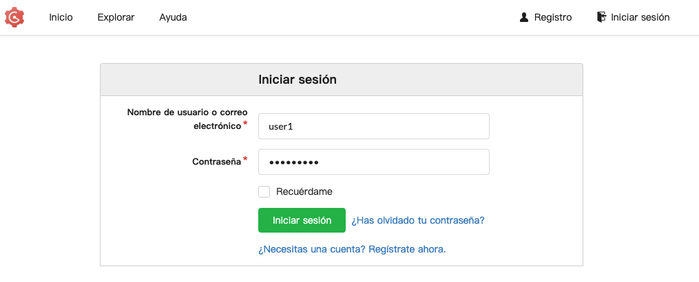
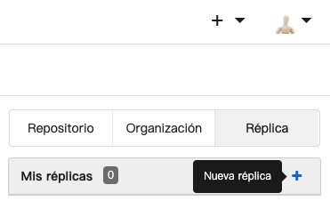
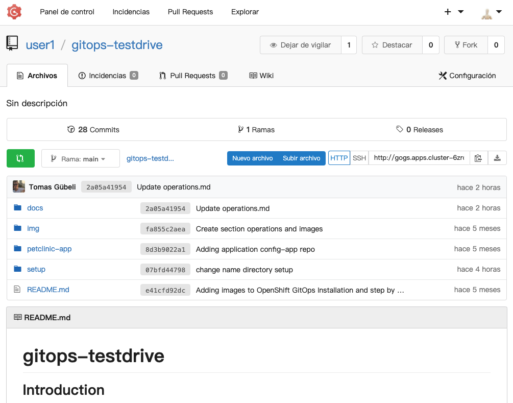

# Prepare a Git repository for GitOps

## Prepare a Git repository with the application configurations

The configurations related to the application (K8s Deployments, Services, PVs, etc) will be stored on a Git repository called "gitops-testdrive". In order to take control over this GIT (make changes) we must be the owner or a collaborator. In this case we are going to clone (replicate) an axisting GIT repo with all the configurations and structure that we need for this exercise. 

We already have a GIT server deployed into Openshift, so you can create a new account and then clone the pre existing repo.

### Create a GIT account in GOGS

Go to the GIT server (GOGS) and create a new account with the user name given to you (i.e user1, user2 ... userXY)

GIT Server URL: [http://gogs.apps.cluster-6zrqg.6zrqg.sandbox500.opentlc.com/tgubeli/gitops-testdrive](http://gogs.apps.cluster-6zrqg.6zrqg.sandbox500.opentlc.com/tgubeli/gitops-testdrive)

In the login form clic in "Create a new account" link

Next, fill the form with your user name, email (can be a fake one) and password. Then clic "Create a new account".

Then, you are ready to login into GOGS and start using it.

Once you are already logged in, we need to create the GIT repo that will be our "Source of Truth" and will contain all the configurations associated to our application.
In order to do that, we are going to clone/replicate an existing repo that already have those files.

So first clic on the "Replica" tab in the upper right corner and then clic in the "+" button (it will show the "New Replica" label as showed in the image bellow).

Now we need to put the GIT URL that we want to clone and uncheck the "Migration type" option.
Set all the values like this:

* Clone URL: https://github.com/tgubeli/gitops-testdrive
* Propietary: userXY
* Visibility: uncheck
* Migration type: uncheck

Then clic "Migrate Repository".

You are done with this step. We now have a GIT repo that Openshift GitOps is going to use later.

[Go to content](content.md)
[Go to readme](../README.md)
