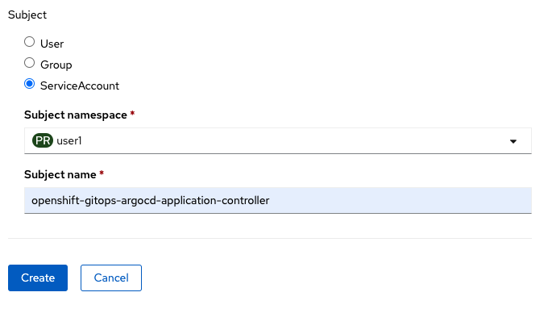

# Prepare a Git repository to GitOps

## Prepare a Git repository with the application configurations

The configurations related to the application (K8s Deployments, Services, PVs, etc) will be stored on a Git repositiry called "gitops-testdrive". In order to take control over this GIT (make changes) we must be the owner or a collaborator. In this case we are going to clone (replicate) an axisting GIT repo with all the configurations and structure that we need for this exercise. We already have a GIT server deployed into Openshift, so you can create a new account and then clone the pre existing repo.

### Create a GIT account in GOGS

Go to the GIT server (GOGS) and create a new account with the user name given to you (i.e user1, user2 ... userXY)

GIT Server URL: [http://gogs.apps.cluster-6zrqg.6zrqg.sandbox500.opentlc.com/tgubeli/gitops-testdrive](http://gogs.apps.cluster-6zrqg.6zrqg.sandbox500.opentlc.com/tgubeli/gitops-testdrive)

In the login forma clic in "Create a new account" link

Then, fill the form with your user name, email (can be a fake one) and password.

Create the Role Binding with the next data:
* Binding Type: Namespace Role Binding
* Name: petclinic-gitops-userXY
* Namespace: userXY-petclinic
* Role: edit
* Subject: Service Account
* Subject Namespace: userXY
* Subject Name: openshift-gitops-argocd-application-controller

The RoleBinding is created and GitOps get access to modify the components on the project

[Go to content](content.md)
[Go to readme](../README.md)
