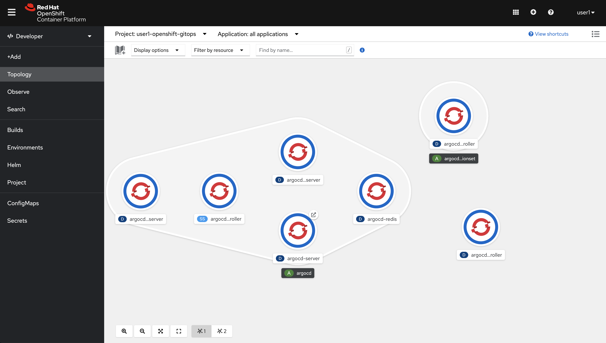
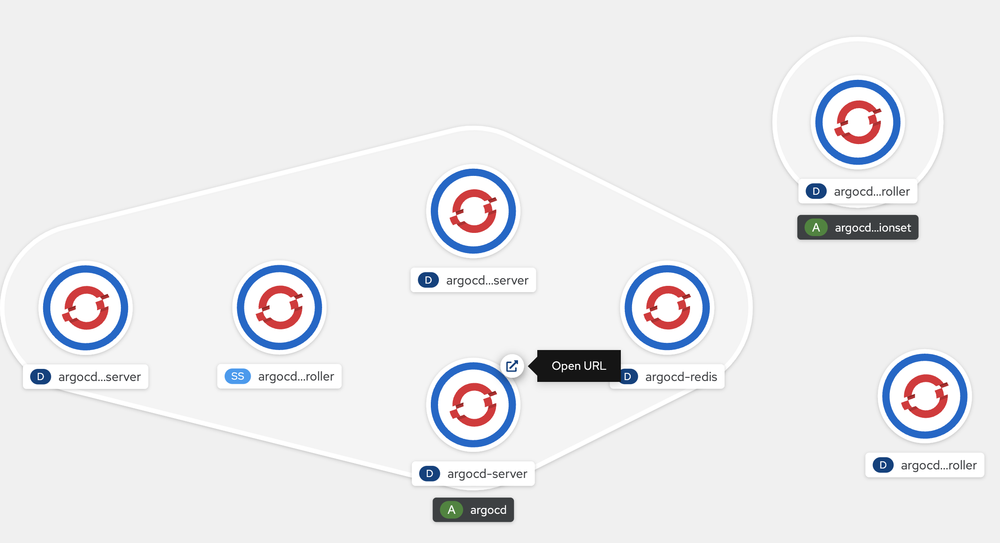
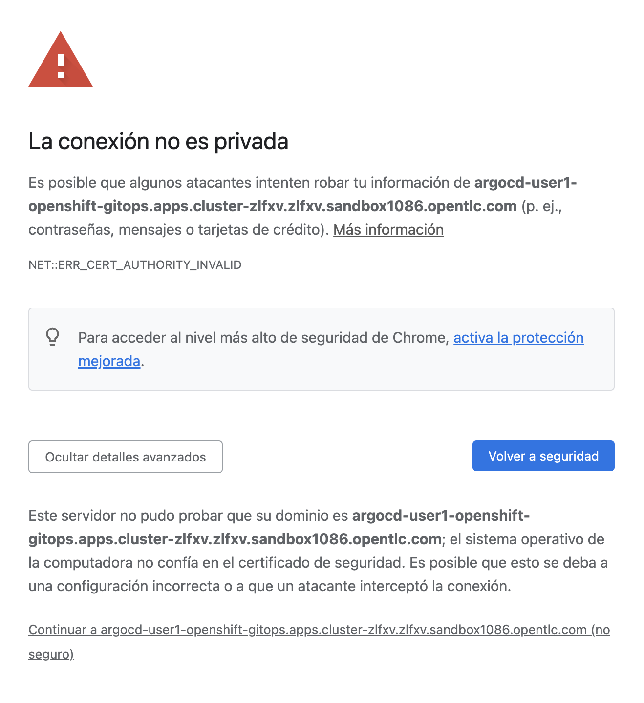
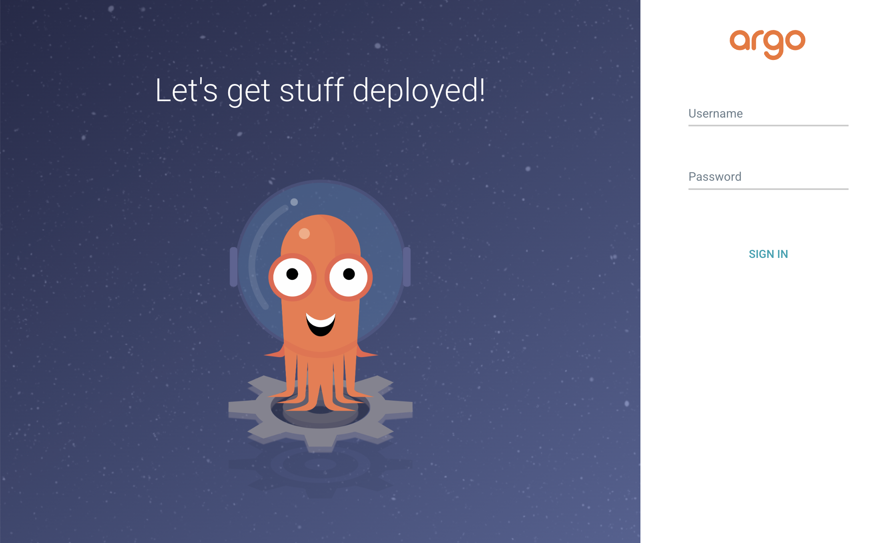
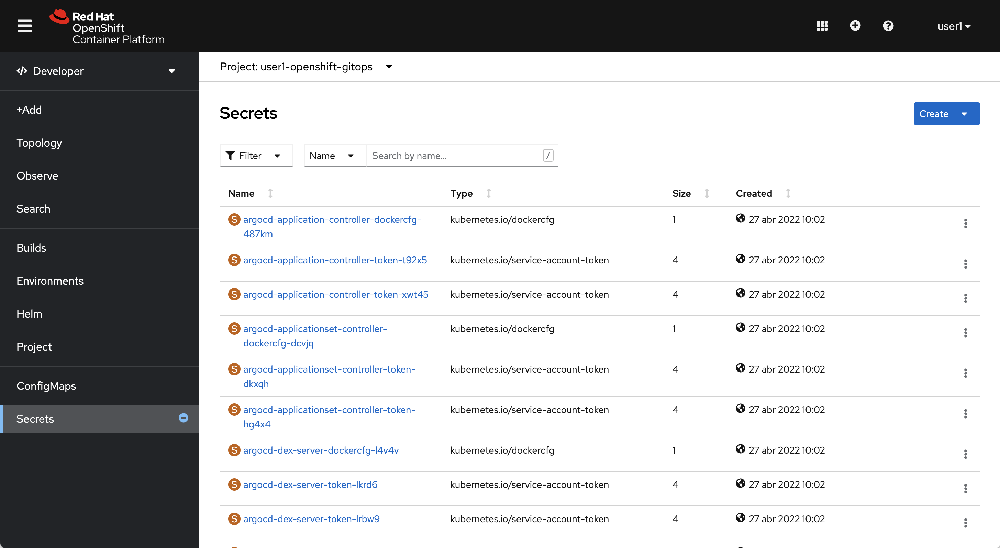
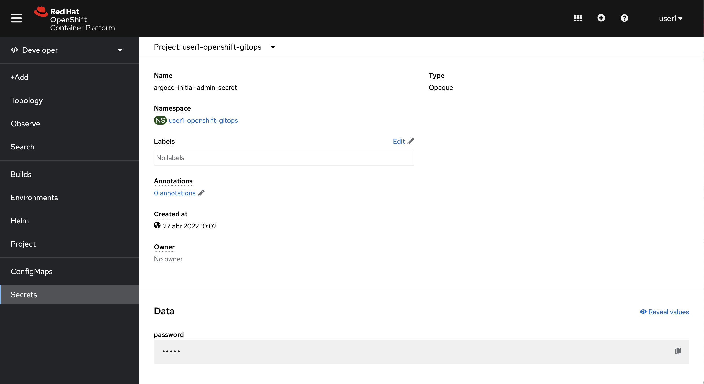

# Deploying a simple application on Cluster

The application to deploy is PetClinic, this application is stored now in your GIT repo on the "petclinic-app/02-petclinic" path.

The goal in this section is navigate and deploy this applicaction on the cluster.

# Start ArgoCD Console

For this excercise, every user has his own ArgoCD server already deployed in a namespace called "userXY-openshift-gitops". In order to access to the ArgoCD web console and login, go to Developer view > Select Topology from the left menu > Then select the Project "userXY-openshift-gitops"

Now click in the arrow next to the POD called "argo-server" to open the URL.

If your browser shows a security conection issue, please accept and proceed with the URL (we install ArgoCD with a self-signed certificate).

The ArgoCD web console will be open now. 

We are going to access with the ArgoCD "admin" user in order to get all the features that ArgoCD offers. So first we need to obtain the default "admin" password. In order to do so, go to the Openshift Web Console > then "Developer View" > then select "Secrets" from the left menu:

Click in the "argocd-initial-admin-secret" secret and look at the "Data" section. There is a key with name "password" and has a hidden value. Click in "Reveal values" link in order to reveal the password. Then take note of this password.

Return to the ArgoCD's login page and login with the "admin" user and enter the password. Verify that has access to ArgoCD console

Create a new application

Write the follow data in General section:

* Application name: petclinic
* Project: default
* Sync Policy: Manual

Complete the source and destination

*Source*

* Repository URL: [your-git-repo-url]/gitops-testdrive
* Revision: HEAD
* Path: petclinic-app/02-petclinic

Example with GitHub: https://github.com/[your-username]/gitops-testdrive

*Destination*

* Cluster URL: https://kubernetes.default.svc
* Namespace: petclinic

Finally, maintain the values of Kustomize as the image

Select **Create** in the top of screen and wait to application Syncronize

The application is present on the main ArgoCD Main Screen

Select Sync over the petclinc application and confirm default options

When the application is syncronized, go to OpenShift and explore the application

On OpenShift go to Developer perspective and identify all objects created

* What objects was created?
* Where is located the application?
* What is the application objective?

[Go to content](content.md)
[Go to readme](../README.md)
